# Learning to Identify Graphs in Multi-robot Networks

This repository provides the code for our paper "Learning to Identify Graphs from Node Trajectories in Multi-Robot Networks". Please check out our project website for more details: https://eduardosebastianrodriguez.github.io/LIGMRS/.

## Dependencies

Our code is tested with Ubuntu 20.04 and Python 3.10. It depends on the following Python packages: 

```torch 1.12.1``` 

```torchdiffeq 0.2.3``` 

```numpy 1.24.3```

```matplotlib 3.7.1```

## Demo with a multi-robot formation task
The ```./formation/``` folder contains all the files to train and evaluate our approach in a multi-robot formation task.

|      ground-truth weighted adjacency matrix       |      discovered weighted adjacency matrix       | difference between matrices                     |       thresholded difference between matrices        |
|:-------------------------------------------------:|:-----------------------------------------------:|:---------------------------------------------------:|:----------------------------------------------------:|
| 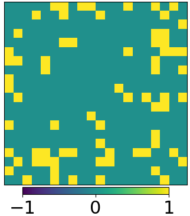 | 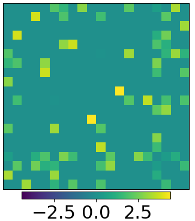 | 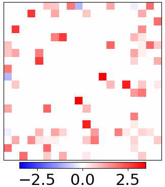 | 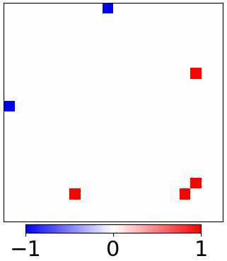 |  
| 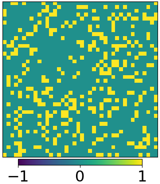 | 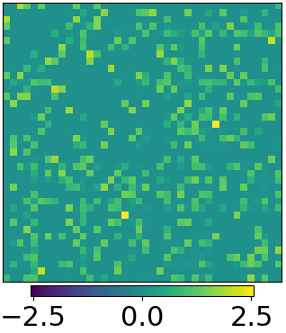 | 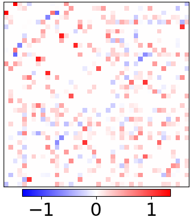 | 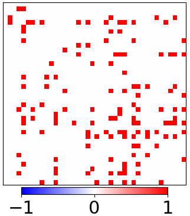 |  
| 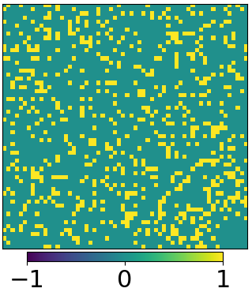 | 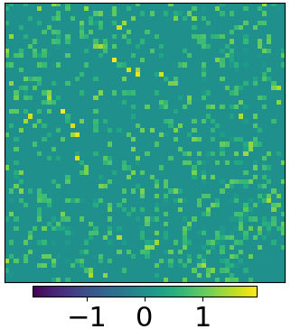 | 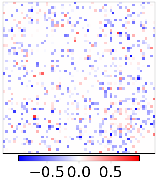 | 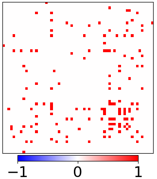 |  

You can train your own neural network by running ```python ./formation/training.py```. The configuration of the training is as specified in our paper (see citation below). You can modify the different parameters and hyperparameters as your convenience. Their meaning is also described in the paper.

You can also just try our pre-trained model by running ```python ./formation/evaluation.py```. As before, the configuration of the different parameters and hyperparameters reproduce the results in our paper, but they can be changed as you want.

You can reproduce the figures of our paper by running ```python ./formation/plot.py```.

The file ```./formation/functions.py``` contains all the functions needed to run the other scripts.

## Demo with a multi-robot flocking task
The ```./flocking/``` folder contains all the files to train and evaluate our approach in a multi-robot flocking task.

|      ground-truth weighted adjacency matrix      |      discovered weighted adjacency matrix      |          difference between matrices           |
|:------------------------------------------------:|:----------------------------------------------:|:----------------------------------------------:|
| 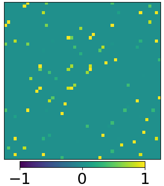 | 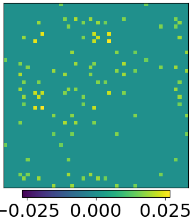 | 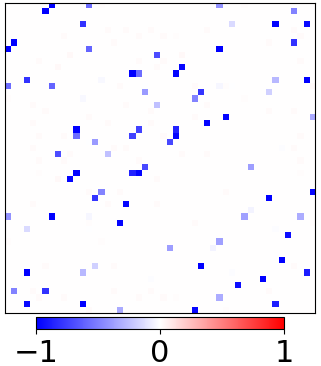 |  
| 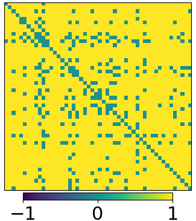 | 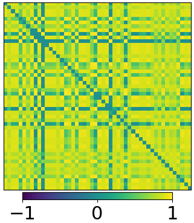 | 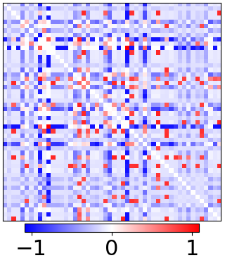 |  
| 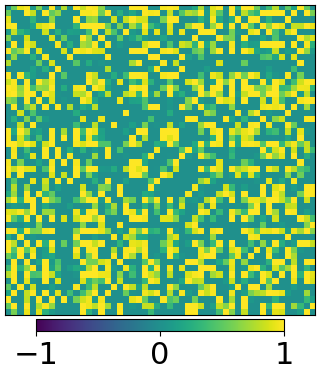 | 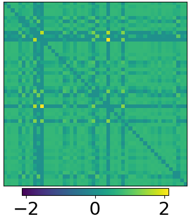 | 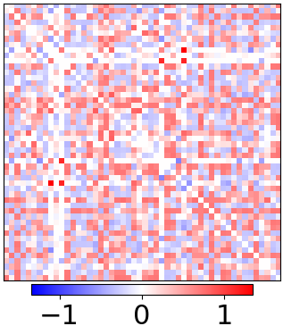 |

You can train your own neural network by running ```python ./flocking/training.py```. The configuration of the training is as specified in our paper (see citation below). You can modify the different parameters and hyperparameters as your convenience. Their meaning is also described in the paper.

You can also just try our pre-trained model by running ```python ./flocking/evaluation.py```. As before, the configuration of the different parameters and hyperparameters reproduce the results in our paper, but they can be changed as you want.

You can reproduce the figures of our paper by running ```python ./flocking/plot.py```.

The file ```./flocking/functions.py``` contains all the functions needed to run the other scripts.

Finally, you can train or try other flocking trajectories by running ```python ./flocking/generateFlockingDataset.py```, which uses the file ```./flocking/flockingFunctions.py``` that implements all the control and simulation functions to generate flocking trajectories.
## Citation
If you find our papers/code useful for your research, please cite our work as follows.

E. Sebastian, T. Duong, N. Atanasov, E. Montijano, C. Sagues. [Learning to Identify Graphs from Node Trajectories in Multi-Robot Networks](https://eduardosebastianrodriguez.github.io/LIGMRS/). Accepted at IEEE MRS 2023

 ```bibtex
@inproceedings{sebastian23LIGMRS,
author = {Eduardo Sebasti\'{a}n AND Thai Duong AND Nikolay Atanasov AND Eduardo Montijano AND Carlos Sag\"{u}\'{e}s},
title = {{Learning to Identify Graphs from Node Trajectories in Multi-Robot Networks}},
booktitle = {IEEE International Symposium on Multi-robot \& Multi-agent Systems},
pages={1--7},
year = {2023}
}
```
